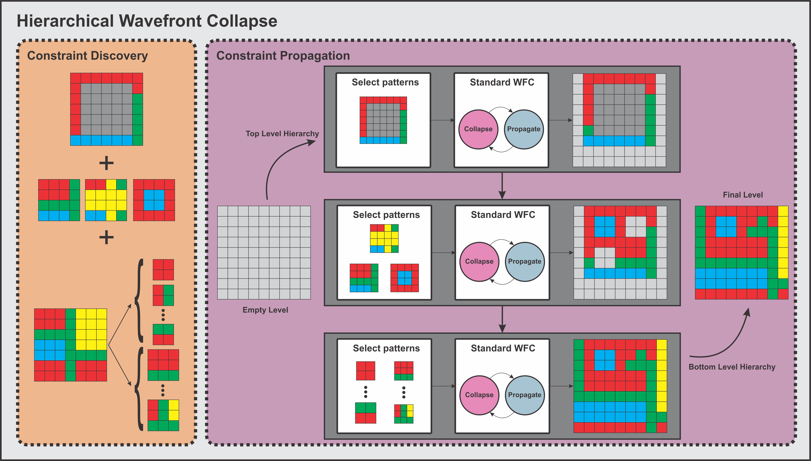
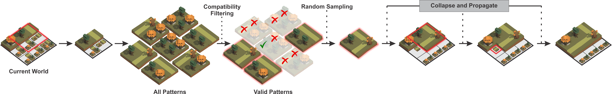
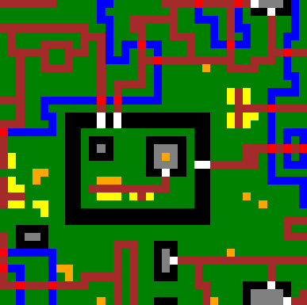
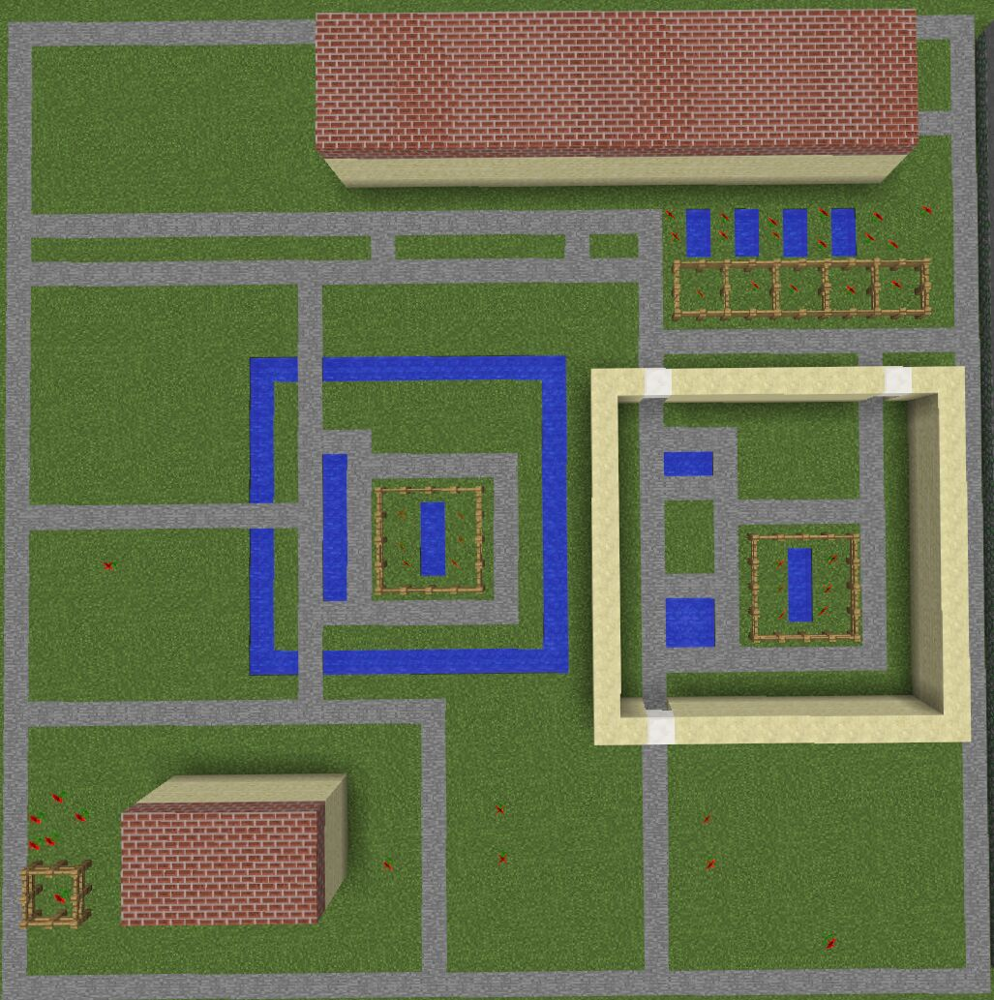
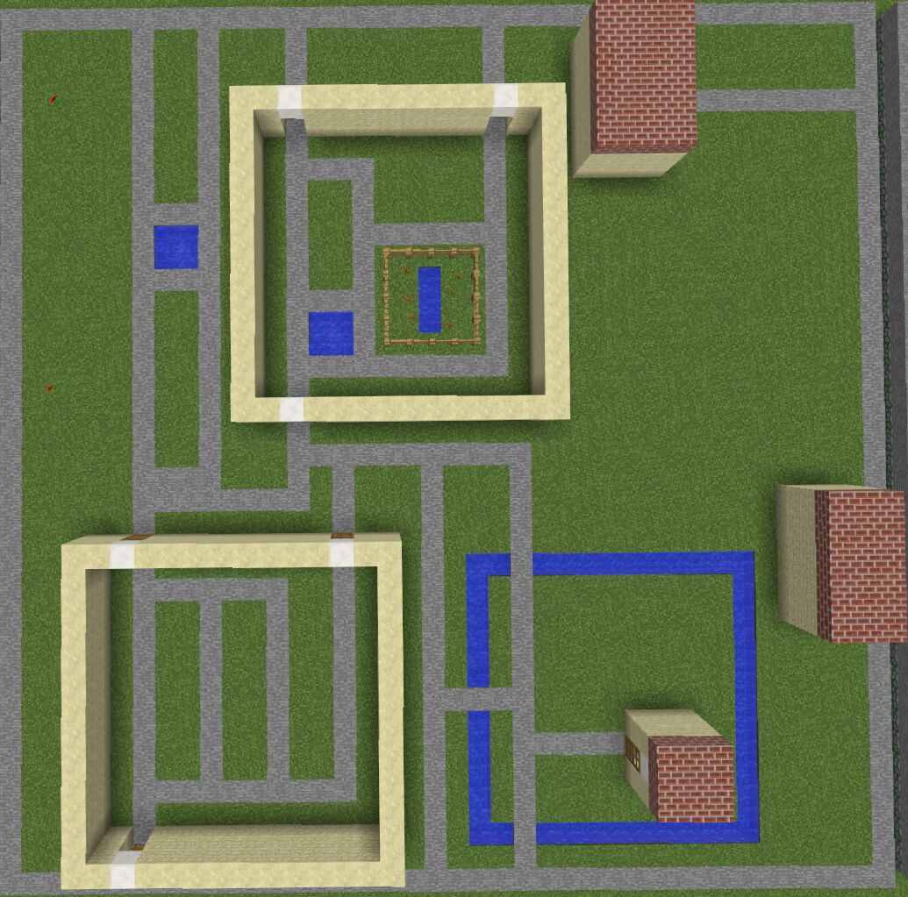
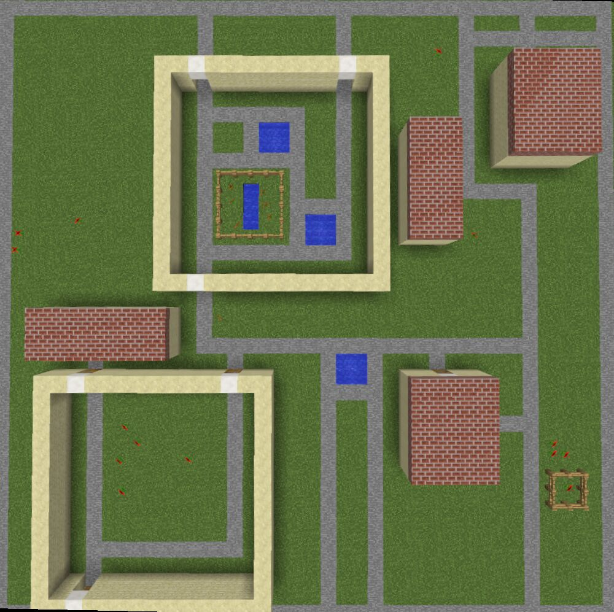
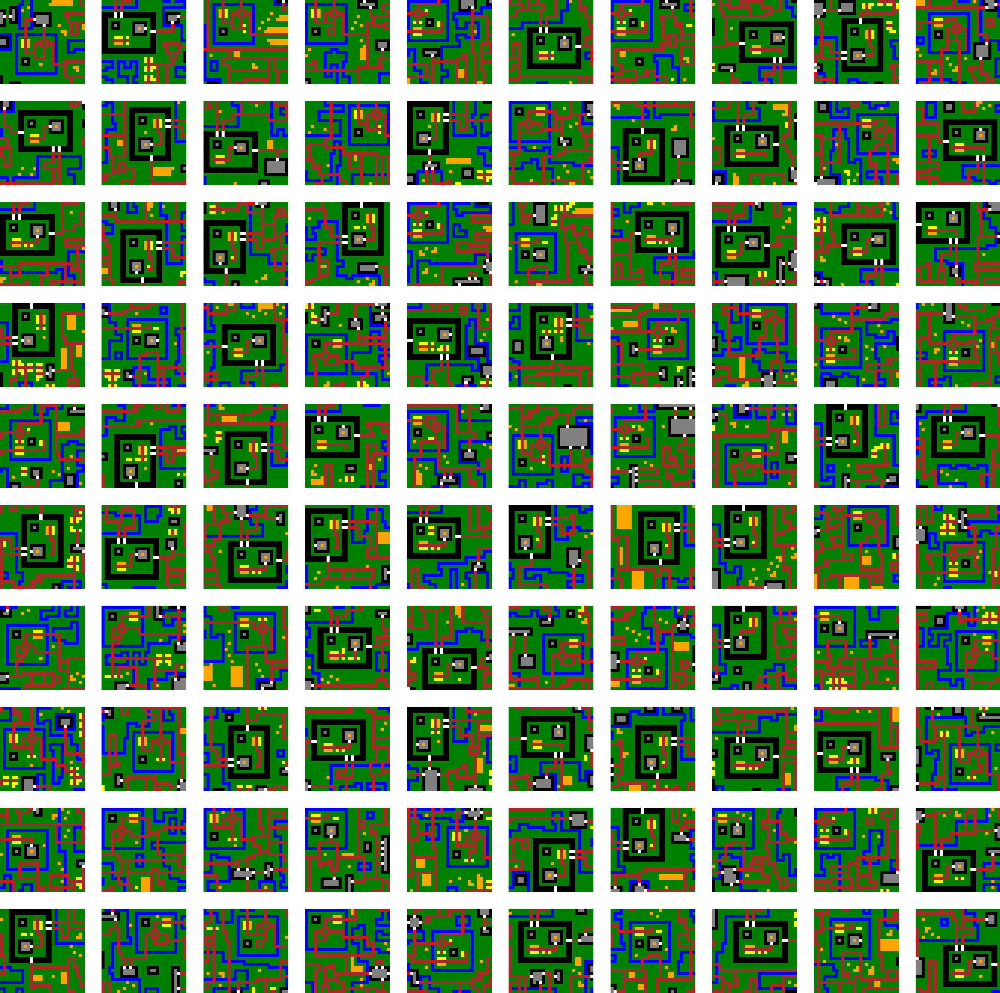

# HWFC - Hierarchical WaveFunction Collapse

<p align="center">
<a href="#how-this-works">Generation Approach</a> &mdash; <a href="#environment-setup">Get Started</a> &mdash; <a href="#demo">Demo</a> &mdash; <a href="#examples">Examples</a>  &mdash; <a href="https://ojs.aaai.org/index.php/AIIDE/article/download/27498/27271">Paper</a> 
</p>

- [HWFC - Hierarchical WaveFunction Collapse](#hwfc---hierarchical-wavefunction-collapse)
  - [How this Works](#how-this-works)
  - [Environment Setup](#environment-setup)
  - [Experiments](#experiments)
    - [Demo](#demo)
    - [Reproducibility](#reproducibility)
    - [Setting Up Minecraft](#setting-up-minecraft)
    - [Generating your own levels in Minecraft](#generating-your-own-levels-in-minecraft)
  - [Code Structure](#code-structure)
  - [Examples](#examples)
  - [Projects Used](#projects-used)


<p align="center">
  </img>
</p>

## How this Works
Our approach builds on the popular [WaveFunctionCollapse algorithm](https://github.com/mxgmn/WaveFunctionCollapse) (WFC) by adding in additional structure through the use of hierarchical elements. In particular, a designer designs some larger structures (that are partially incomplete) that they want in a level, and we place them in using WFC. We then call WFC again, with a set of medium-level designed patterns. Finally, we fil out the level with a final call to WFC, this time with the normal patterns extracted from the example.



## Environment Setup
To set up your python environment, do the following to create an environment with the correct version.
```
conda create -n hwfc python=3.9
```

then run this to activate it
```
conda activate hwfc
```
And finally, install the necessary packages using pip.

```
pip install -r requirements.txt
```

**[Important]** Then, to run any python file in here, use `./run.sh path/to/python/file` from the root of this repository instead of using `python` directly, as otherwise modules are not recognised.


## Experiments
**[Important]** If you want to run the minecraft results, first set it up as described [here](#setting-up-minecraft).
### Demo
To start generating levels, you can use `hwfc/main.py`. In particular, you can run
```
./run.sh hwfc/main.py --game GAME --method METHOD --level-size SIZE --seed SEED
```
Where,
- `GAME` is either "maze", "2.5D" or "minecraft"
- `METHOD` is either "HWFC", "WFC" or "MWFC"
- `SIZE` is an integer level size, optional; defaults to 30
- `SEED` is an integer random seed, optional; defaults to 42


For instance, 
```
./run.sh hwfc/main.py --game "2.5D" --method "HWFC" --level-size 40 --seed 101
```
Results in the following level

<p align="center">
  
</p>

### Reproducibility
Our results can be replicated as follows:

0. Set `DO_LOG = True` in `hwfc/solver.py:24`
1. Run `auto.sh`
```
./auto.sh
```
2. This will run in parallel.
3. Then, run `hwfc/analysis/metrics.py`
```
./run.sh hwfc/analysis/metrics.py
```
4. Then run `hwfc/analysis/plot_values.py`
```
./run.sh hwfc/analysis/plot_values.py
```

Then, all of the results will be in the directory `results/paper`.

### Setting Up Minecraft
For minecraft, follow the instructions [here](https://github.com/real-itu/Evocraft-py), and start the minecraft server & client first. 
The TL; DR is that you must `cd lib/Evocraft-py` and run `java -jar spongevanilla-1.12.2-7.3.0.jar`. 
Then, open the Minecraft client and connect to localhost. The Python code that relies on the Minecraft server can then be run.


### Generating your own levels in Minecraft
First, in the server, type `/tp @p 990 6 1000` and press enter.
Then, run 
```
./run.sh hwfc/minecraft/place.py
```

You should then see some generated levels, as well as patterns.
You can change these patterns and run the following to save those patterns as text files (note, this will overwrite the existing ones)
```
./run.sh hwfc/minecraft/read.py
```

Then you could generate minecraft levels as described [here](#demo).


If you want more information, or want to add additional slots for patterns, have a look at `hwfc/minecraft/read.py`; you can add additional locations there.
## Code Structure

The code is structured as follows
```
├── examples                            -> Contains the example levels/hierarchies
├──hwfc                                 -> Main codebase
│  ├── analysis                         -> Contains the analysis code/metrics
│  ├── experiments                       
│  │   └── all_exps.py                  -> Main experiment runner
│  ├── external                         -> Contains some minecraft utilities
│  ├── generators                       -> Contains the three methods
│  │   ├── hierarchical_wfc.py          -> Our HWFC implementation
│  │   ├── multiscale_wfc.py            -> MWFC
│  │   └── wfc.py                       -> Normal WFC
│  ├── main.py                          -> This is the entry point to start generating
│  ├── minecraft                        -> Contains code for integrating with Minecraft
│  ├── solver.py                        -> This contains the main WFC implementation
│  ├── utils                            -> Contains some utility functions
│  └── world.py                         -> Class representing the map
├── lib                                 -> Contains the Evocraft library
└── results                             -> Contains images and experiment's json data.
```

## Examples
Here are some example generated levels.
<p style="text-align:center; width:100%" align="center">
  
  
  
</p>

And here are some levels from the other games
<p style="text-align:center; width:100%" align="center">
  
  
</p>


## Projects Used
[Evocraft-Py](https://github.com/real-itu/Evocraft-py), used to integrate with Minecraft.
